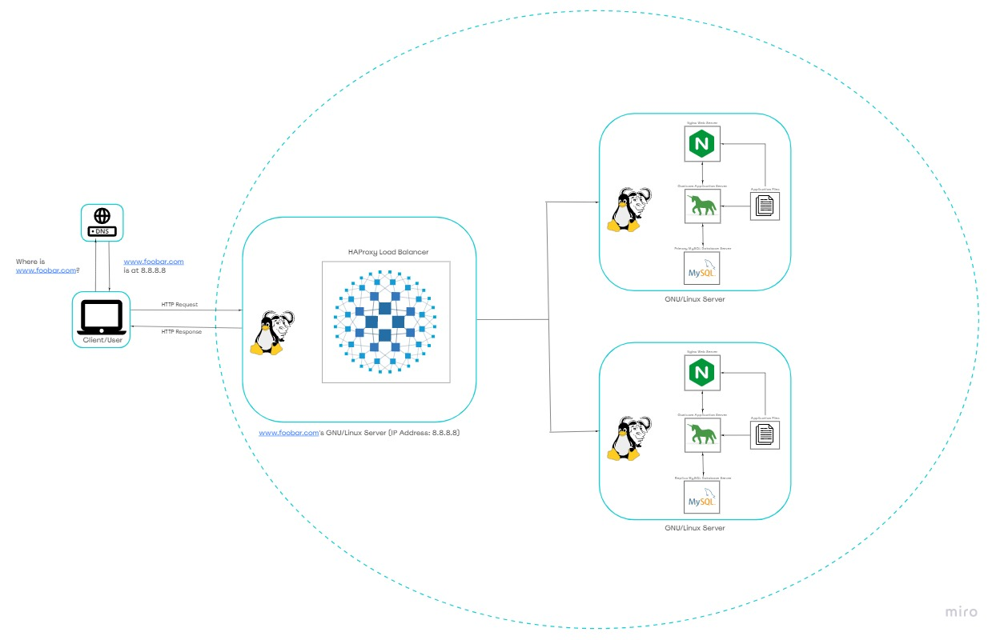

# Distributed Web Infrastructure

## Description

This is a distributed web infrastructure designed to reduce traffic to the primary server by distributing some of the load to a replica server. A load balancer is used to evenly distribute the workload between the two servers.

## Specifics About This Infrastructure

+ Load Balancer Configuration: The HAProxy load balancer is configured with the *Round Robin* distribution algorithm. This algorithm evenly distributes the workload among the servers based on their weights.
+ Setup: The load balancer enables an *Active-Passive* setup, where one server is active and the other is passive. The passive server becomes active if the active server becomes inactive.
+ Primary-Replica Database Cluster: The infrastructure uses a *Primary-Replica* setup, where one server acts as the primary server for read/write operations, and the other server acts as a replica for read operations.
+ Difference Between Primary and Replica: The primary node handles write operations, while the replica node handles read operations, reducing the read traffic to the primary node.

## Issues With This Infrastructure

+ Single Point Of Failure (SPOF): The primary MySQL database server, load balancer server, and application server connecting to the primary database server are all potential SPOFs.
+ Security Issues: Data transmission over the network is not encrypted, making it vulnerable to eavesdropping. There is also no firewall installed to block unauthorized access.
+ Lack of Monitoring: There is no monitoring system in place to track the status of each server.
