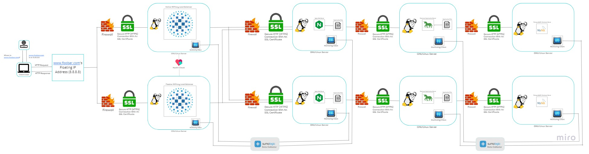

# Scaled Up Web Infrastructure

## Description

This web infrastructure is an upgraded version of the infrastructure described in [2-secured_and_monitored_web_infrastructure.md]. It eliminates single points of failure (SPOFs) by separating the major components (web server, application server, and database servers) onto separate GNU/Linux servers. Each server's network is protected by a firewall and monitored.

## Specifics About This Infrastructure

- Each server is protected by a firewall, enhancing security.
- The SSL protection is not terminated at the load-balancer.

## Issues With This Infrastructure

- High maintenance costs: The need for additional servers increases expenses, including server purchase and electricity consumption.
